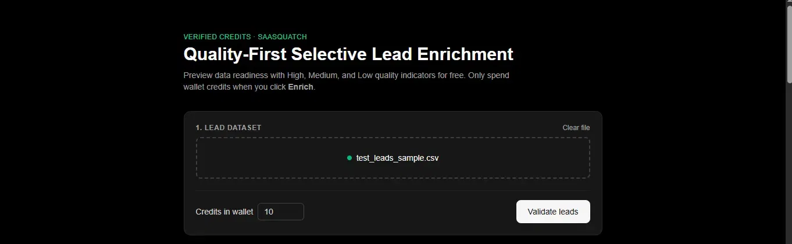
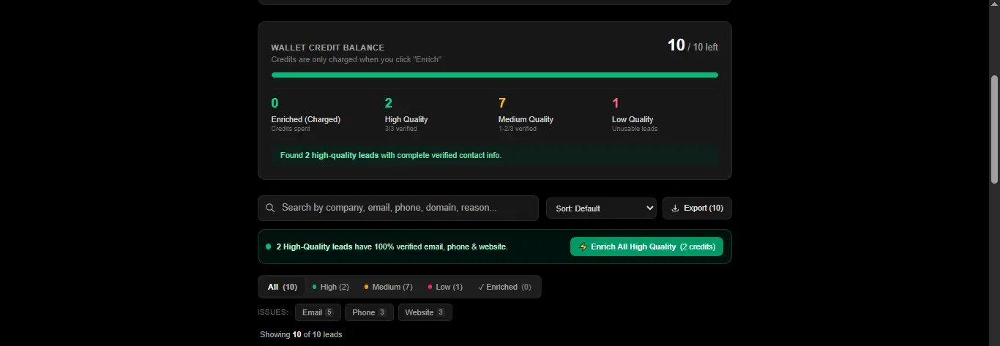
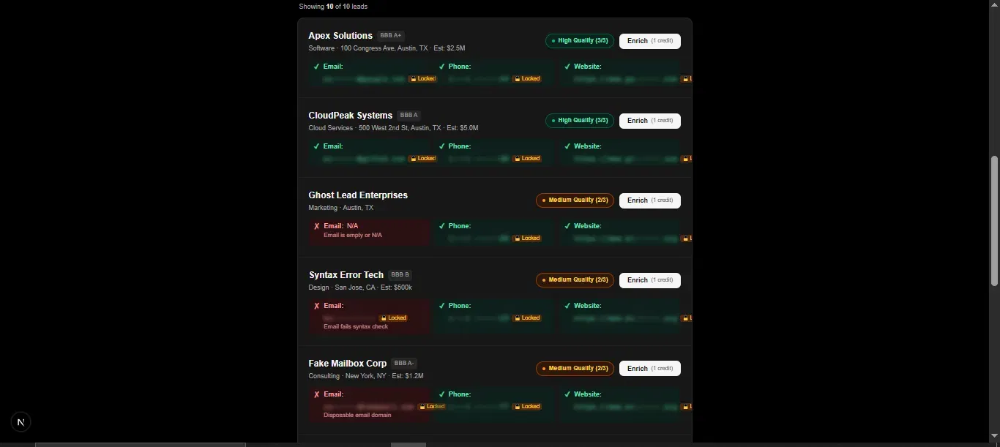
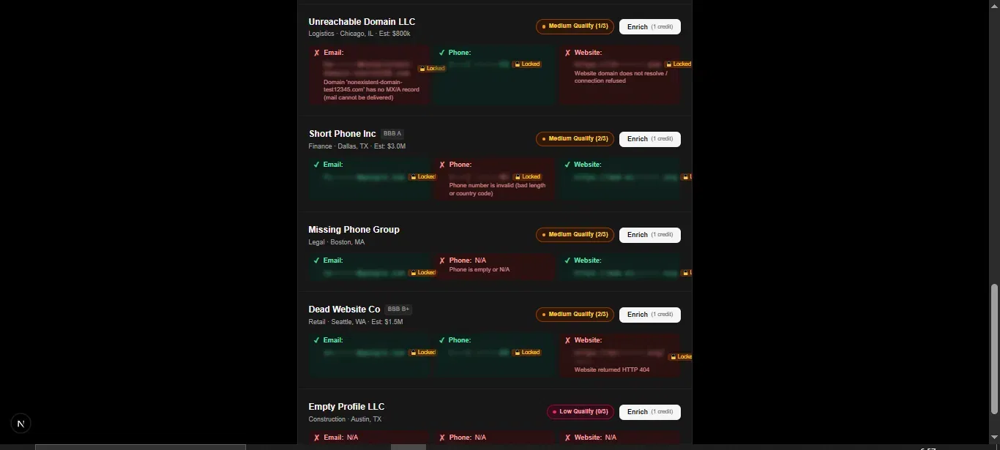
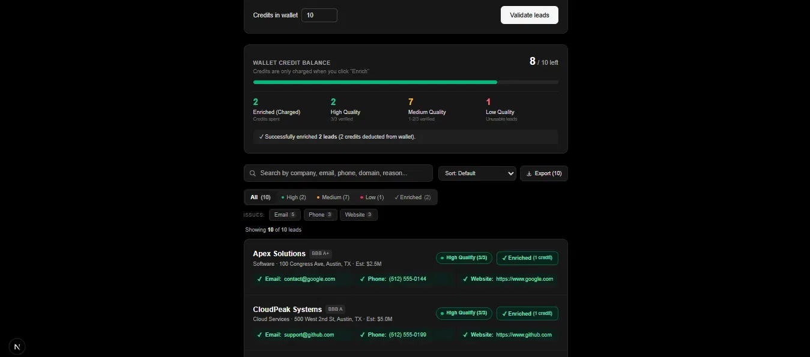

# Verified Credits — Quality-First Selective Lead Enrichment

**Preview lead quality for free. Only spend credits when you choose to Enrich.**
A trust-layer enhancement to [SaaSquatch Leads](https://www.saasquatchleads.com/), built for Caprae Capital's AI-Readiness pre-screening challenge.

---

## 1. The Problem This Solves

SaaSquatch charges 1 credit per enriched lead. The original platform reveals all contact data upfront and charges on every click regardless of data quality. Records with `N/A` phones, dead websites, or invalid emails still consume credits — leaving customers with no way to assess a lead's value before paying.

**For a $19/mo Bronze customer with 50 credits, even 5–6 broken records is a meaningful loss — and it's invisible until a bounce.**

---

## 2. Our Improvement: Quality-Gated Selective Enrichment

Two layered improvements were added on top of the original platform:

### 2a. Quality Scoring (Free — Before Any Credit Is Spent)

Every lead is validated against three live checks **before** the user spends a single credit:

| Field   | How It's Checked                                                                           | Tier Impact |
|---------|--------------------------------------------------------------------------------------------|-------------|
| Email   | Syntax check + live DNS MX lookup (A-record fallback) via `dnspython`                     | Critical    |
| Phone   | Google `libphonenumber` parse — catches wrong country code & wrong length                 | Critical    |
| Website | Live HTTP GET, redirect-following, 8 s timeout, status + parked-domain heuristics         | Critical    |

Results are mapped to **Quality Tiers**:

| Tier   | Condition             | Colour |
|--------|-----------------------|--------|
| High   | 3/3 fields verified   | Green  |
| Medium | 1–2/3 fields verified | Amber  |
| Low    | 0/3 fields verified   | Red    |

### 2b. Data Blurring Until Enrichment

After validation, contact details (email, phone, website) are **masked/blurred** with a 🔒 Locked indicator until the user explicitly clicks **Enrich**. Only `N/A` / missing values are shown as-is — they convey no useful data anyway.

Masking examples:
- **Email** → `ta••••••@domain.com` (prefix hidden, domain kept for trust context)
- **Phone** → `(•••) •••-••12` (last 2 digits shown)
- **Website** → `https://te••••••.com` (first 2 chars + TLD shown)

Customers can read the Quality badge and understand *why* a lead is broken — without getting free contact data.

---

## 3. Credit Model — Charge Only on Intent

| When               | What Happens                                                              |
|--------------------|---------------------------------------------------------------------------|
| After CSV upload   | Backend runs live validation; quality scores computed; **0 credits spent** |
| Data displayed     | Contact details are blurred; Quality badge shown per lead                 |
| User clicks Enrich | 1 credit deducted; that lead's contact details are unmasked               |
| Batch Enrich       | "⚡ Enrich All High Quality" button enriches all 3/3-verified leads in one click |

Credits are tracked in a live wallet meter. No credit is ever spent without an explicit user action.

---

## 4. UI Screenshots

### Upload & Validate
Upload a SaaSquatch CSV, set your credit wallet, and click **Validate leads**. Zero credits are spent at this step.



---

### Wallet Credit Balance — Quality Breakdown
After validation, the wallet panel shows a live breakdown: how many leads are High, Medium, and Low quality. Enriched count stays at **0** until you manually enrich.



---

### Lead List — Blurred Data & Quality Badges
Every lead shows its Quality badge and per-field status chips. Contact details (email, phone, website) are **blurred** behind a 🔒 Locked indicator. Red ✗ chips show exactly why a field failed — before you spend anything.





---

### After Enrichment — Data Unmasked
Once you click **Enrich** (or **⚡ Enrich All High Quality**), 1 credit is deducted per lead and the full contact details are revealed instantly. The wallet balance updates in real-time.



---

## 5. User Flow

1. Drop in a SaaSquatch-style CSV export or click **"load the sample dataset instead"**.
2. Set **wallet credits** and click **Validate**.
3. Backend runs live email/phone/website checks in parallel for every lead.
4. Results appear with **Quality badges** (High / Medium / Low) and **blurred contact details**.
5. Browse leads. Filter by quality tier, issue type (Email / Phone / Website), or search by company/reason.
6. Click **Enrich** on individual leads (1 credit each) or **⚡ Enrich All High Quality** to batch-enrich all 3/3 verified leads in one shot.
7. Contact details unmask immediately on enrichment.
8. Export a CSV audit log of the current view (injection-safe).

---

## 6. Architecture

```
Browser (Next.js/React)  --multipart CSV-->  FastAPI backend
        |                                         |
        |<--- JSON: per-lead checks + quality scores + ledger ---|
        |
   client-side masking until Enrich clicked
   client-side credit deduction on Enrich
   client-side CSV export (no server round-trip)
```

| Layer         | Choice                                                       | Why                                                                                   |
|---------------|--------------------------------------------------------------|---------------------------------------------------------------------------------------|
| Frontend      | **Next.js 16 (App Router) + React 19 + TypeScript**, Tailwind CSS v4 | Fast to ship; App Router enables streaming/RSC if needed                     |
| Backend       | **Python + FastAPI**, async route handlers                   | I/O-bound validation (DNS/HTTP) maps cleanly to async fan-out                         |
| Email check   | `dnspython` MX + A-record fallback, `lru_cache`              | Real deliverability signal; cache avoids repeat DNS for same domain                   |
| Phone check   | `phonenumbers` (Google libphonenumber)                       | Catches wrong country code / length — naive regex cannot                              |
| Website check | `httpx` GET, redirect-following, 8 s timeout                 | Real reachability + parked-domain heuristics                                          |
| Concurrency   | `asyncio.gather` + thread-pool executor per lead             | Blocking DNS/HTTP calls parallelised across the batch without a queue/worker system   |
| Data blurring | Client-side CSS blur + masked strings in `lib/mask.ts`       | Zero server state; unmask is instant on Enrich click                                  |

**Data storage:** none — stateless request/response. No database, no persistent state; scales horizontally.

**Hosting:** Next.js → Vercel (or any static CDN). FastAPI → Cloud Run / Fly.io / Docker.

---

## 7. Run It Locally

### Ports
| Service  | Default Port | URL                    |
|----------|-------------|------------------------|
| Frontend | 3123        | http://localhost:3123  |
| Backend  | 8000        | http://localhost:8000  |

### Backend
```bash
cd backend
python -m venv env
env\Scripts\activate          # Windows; or: source env/bin/activate
pip install -r requirements.txt
uvicorn app.main:app --port 8000
pytest                         # run unit tests for validators
```

### Frontend
```bash
cd frontend
npm install
cp .env.local.example .env.local    # sets NEXT_PUBLIC_API_URL=http://localhost:8000
npm run dev -- --port 3123
```

Open `http://localhost:3123`. Drop in a CSV or click **"load the sample dataset instead"**.

> **Windows note:** if the project path contains `&` (e.g. `Desktop\R&D\...`), `npm run dev` fails with `MODULE_NOT_FOUND` because `cmd.exe` splits on `&`. The `package.json` scripts are already patched to call `node node_modules/next/dist/bin/next` directly, bypassing the `.cmd` shim entirely. If you still see the error, run:
> ```
> node node_modules/next/dist/bin/next dev --port 3123
> ```

---

## 8. Limitations & Next Steps

| Limitation | Detail | Production Path |
|---|---|---|
| No mailbox-level verification | MX records prove the domain can receive mail, not that the specific mailbox exists | Integrate a reputable SMTP-probe / mailbox-verify API behind `validate_email` |
| Single GET for website | Catches dead/parked/erroring sites; not "up but empty" | Layer a site-enrichment crawl (cf. LeadRadar's approach) |
| No persistence | Each validation run is fully stateless | Log charge/refund decisions to DB for dispute resolution and "credits saved" reporting |
| Fixed tier boundaries | 3/3=High, 1-2/3=Medium, 0/3=Low | Expose thresholds as plan-level config (partial credit for 2/3, etc.) |

---

## 9. Project Layout

```
verified-credits/
├── backend/
│   ├── .env.example             # copy to .env and fill in
│   ├── .gitignore
│   ├── requirements.txt
│   ├── Procfile                 # for Heroku / Railway deploy
│   ├── app/
│   │   ├── main.py              # FastAPI app — /health, /api/sample, /api/validate
│   │   ├── models.py            # Pydantic schemas: RawLead, ValidatedLead, LedgerSummary
│   │   ├── validators.py        # email (DNS MX) / phone (libphonenumber) / website (httpx) checks
│   │   ├── ledger.py            # per-lead quality scoring + batch ledger summary
│   │   └── csv_io.py            # SaaSquatch-style CSV parsing + bundled sample dataset
│   └── tests/
│       └── test_validators.py
│
├── frontend/
│   ├── .env.local.example       # copy to .env.local (NEXT_PUBLIC_API_URL=http://localhost:8000)
│   ├── .gitignore
│   ├── package.json
│   ├── app/
│   │   ├── page.tsx             # Main page: upload → validate → browse → enrich
│   │   ├── layout.tsx           # Root layout + font config
│   │   └── globals.css          # Tailwind base + theme tokens
│   ├── components/
│   │   ├── UploadPanel.tsx      # CSV upload, wallet credits input, Validate button
│   │   ├── CreditMeter.tsx      # Wallet balance bar + quality breakdown stats
│   │   ├── ResultsTable.tsx     # Lead cards: filter, search, sort, Enrich buttons
│   │   ├── FieldChip.tsx        # Per-field chip with blur/unlock masking
│   │   ├── QualityBadge.tsx     # High / Medium / Low badge (e.g. 3/3)
│   │   └── ChargeBadge.tsx      # "✓ Enriched (1 credit)" confirmation badge
│   └── lib/
│       ├── api.ts               # Backend API client (validateLeads)
│       ├── types.ts             # TypeScript interfaces mirroring Pydantic models
│       ├── mask.ts              # Email / phone / website masking + isFieldMissing
│       └── export.ts            # CSV audit log builder (formula-injection safe)
│
└── docs/
    └── screenshots/
        ├── 01_upload.png
        ├── 02_wallet_quality.png
        ├── 03_lead_list_top.png
        ├── 04_lead_list_bottom.png
        └── 05_after_enrich.png
```
